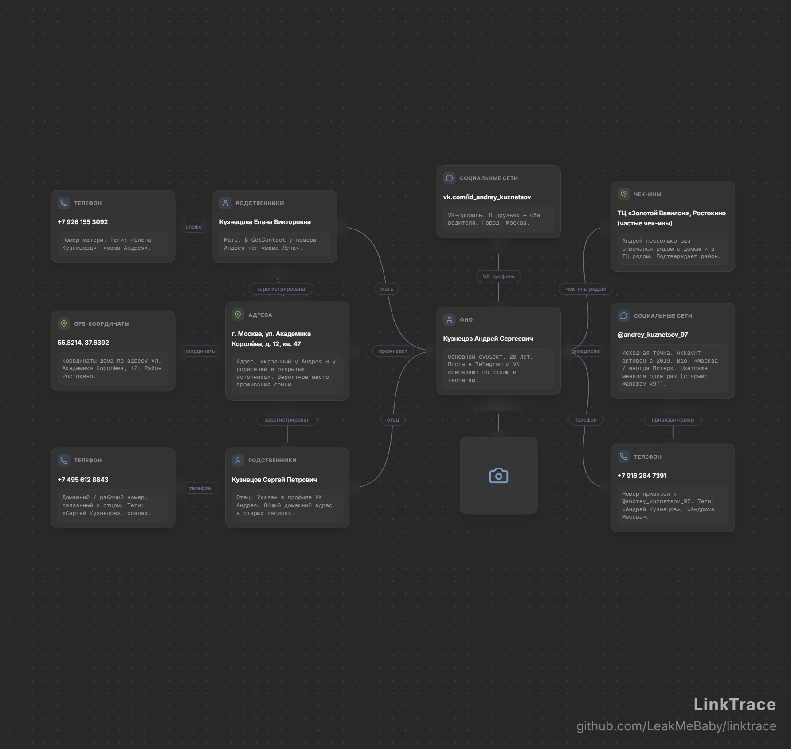

# LinkTrace — OSINT & Link Analysis Platform

<table>
  <tr>
    <td width="130" align="center">
      
    </td>
    <td>
      <h1>LinkTrace</h1>
      <p>An advanced platform for OSINT investigations, digital footprint graph analysis, and entity relationship visualization. Designed for cyber threat intelligence analysts, forensic specialists, investigators, and security teams.</p>
      <p>
        
        
        
      </p>
    </td>
  </tr>
</table>

---

## 📸 Interface Screenshots

### 1. Interactive Graph View (`Graph / Chain`)
Investigation topology visualization featuring nodes categorized by type and dynamic relationships.


### 2. Summary & Data Collection (`Summary / Data Collection`)
Structured registry of all gathered artifacts with category filtering, validation statuses, and evidence proofs. Includes one-click report copying in a formatted structure.


### 3. Node & Evidence Inspector (`Node Inspector`)
Detailed metadata panel for selected elements: collection sources (WHOIS, RiskIQ, CRT.sh, Telegram), verification status, notes, and direct evidence links.


---

## ✨ Key Features

- 🕸 **Interactive Graph View:**
  - Support for custom hierarchies, node types, and weighted edges.
  - Smooth, scalable canvas workspace with dependency highlighting and instant search.
  - Sidebar timeline displaying the chronological discovery of findings (*Timeline*).

- 📋 **Artifact Summary & Filtering:**
  - Categorized grouping:
    - 👤 **Personal Data** (Full name, Telegram ID, Email, Phone numbers, Passports/Tax ID).
    - 🌐 **Digital & Network Artifacts** (IP v4/v6, Domains, Subdomains, SSL certificates, Analytics ID, Cookies, User-Agent).
    - 📍 **Geospatial Data** (Addresses, Geolocation coordinates).
    - 🏢 **Business & Legal Entities** (Company names, Registration IDs, Job titles).
    - 💬 **Content & Metadata** (Posts, Files, Leak databases).
    - 💳 **Financial Artifacts** (Crypto wallets, Bank card numbers, API keys).

- 🔍 **Entity & Node Inspector:**
  - Assign validation statuses: `Verified`, `Pending`, `Unverified`.
  - Specify discovery source/tool (RiskIQ, WHOIS, CT Logs, Telegram, Leak databases).
  - Attach evidence links and custom notes to any object.

- 💾 **Project Management & Export:**
  - Quick entity creation via category palettes.
  - **Canvas Export:** Save the investigation canvas directly as an image (`PNG` / `JPG`).
    
  - **Formatted Report Copying:** Copy the complete investigation report directly from the app in a structured, professional format.
  - Full project import and export in JSON format (`Save JSON`).
  - Global search across all entities, types, and values.

---

## 📋 Example Formatted Report Export

LinkTrace allows exporting reports directly into a clean, structured layout:

```text
[ PERSONAL DATA ]
  1. Email: alex.darktech@proton.me
     • Status: verified
     • Source: WHOIS Registrar / Leak databases
     • Notes: Administrator email specified during certificate registration and payment script metadata.
     • Evidence: https://hole.cert.zone/whois-history

  2. Social Networks: @darktech_sup
     • Status: verified
     • Source: Telegram Search / OSINT bot
     • Notes: Technical support account on the phishing site. ID: 5829104812. Previously used nickname @alex_dt_dev.
     • Evidence: https://t.me/darktech_sup

  3. Phone: +380 97 123 4567
     • Status: pending
     • Source: Telegram API Leak / GetContact
     • Notes: Number linked to account @darktech_sup. GetContact tags: "Alexey Kovalev Prog", "Alex Crypto".
     • Evidence: https://getcontact.example/query

  4. Full Name: Kovalev Alexey Igorevich
     • Status: pending
     • Source: Leak correlation / Social networks
     • Notes: Suspected organizer of the phishing scheme. Age, region, and tech stack match.
     • Evidence: https://vk.com/id102938475


[ DIGITAL & NETWORK ARTIFACTS ]
  1. Domain: crypt0-swift-exchange.com
     • Status: verified
     • Source: VirusTotal / SecurityTrails
     • Notes: Phishing domain mimicking a legitimate crypto exchanger. Registered May 12, 2026 via NameCheap.
     • Evidence: https://www.virustotal.com/gui/domain/crypt0-swift-exchange.com, https://securitytrails.com/domain/crypt0-swift-exchange.com

  2. IP (v4/v6): 194.36.191.85
     • Status: verified
     • Source: Shodan / Censys
     • Notes: PQ Hosting server (Moldova). Running Nginx, open ports 80, 443, 8080.
     • Evidence: https://www.shodan.io/host/194.36.191.85

  3. SSL Certificates: ZeroSSL (CN: crypt0-swift-exchange.com)
     • Status: verified
     • Source: crt.sh
     • Notes: Free certificate issued via ZeroSSL. SAN also includes subdomain api.crypt0-swift-exchange.com.
     • Evidence: https://crt.sh/?q=crypt0-swift-exchange.com


[ GEOSPATIAL DATA ]
  1. GPS Coordinates: 50.4501, 30.5234 (Kyiv)
     • Status: unverified
     • Source: EXIF metadata from Telegram photo
     • Notes: Geotag from original Telegram profile photo prior to deletion.


[ CONTENT & METADATA ]
  1. GitHub / GitLab: github.com/alex-kovalev-dev
     • Status: verified
     • Source: GitHub Search
     • Notes: Public developer profile. Public repository `crypto-drainer-template` shares matching phishing HTML code.
     • Evidence: https://github.com/alex-kovalev-dev/crypto-drainer-template


[ FINANCIAL ARTIFACTS ]
  1. Crypto Wallets: 0x71C7656EC7ab88b098defB751B7401B5f6d8976F
     • Status: verified
     • Source: Etherscan / Chainalysis
     • Notes: Ethereum address of the drainer smart contract where stolen victim funds were aggregated.
     • Evidence: https://etherscan.io/address/0x71C7656EC7ab88b098defB751B7401B5f6d8976F

  2. Transaction Hashes: 0x3a1b8c2d4e5f6a7b8c9d0e1f2a3b4c5d6e7f8a9b
     • Status: verified
     • Source: Etherscan
     • Notes: Withdrawal of 15.5 ETH from the drainer address to a Garantex exchange account.
     • Evidence: https://etherscan.io/tx/0x3a1b8c2d4e5f6a7b8c9d0e1f2a3b4c5d6e7f8a9b

> LinkTrace - github.com/LeakMeBaby/linktrace
```

---

## 🤝 Contributing

Contributions, issues, and feature requests are welcome! Feel free to check out the [issues page](https://github.com/LeakMeBaby/linktrace/issues).

---

## 📝 License

This project is licensed under the **MIT License** — see the [LICENSE](LICENSE) file for details.
