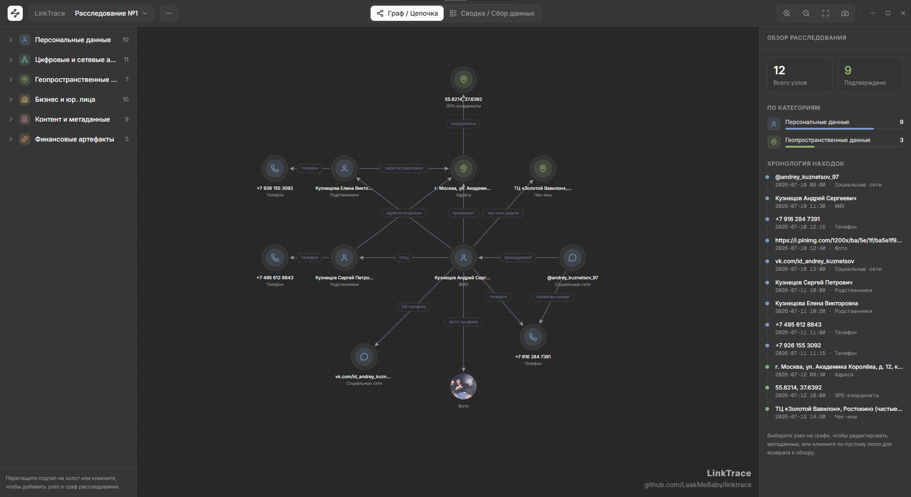
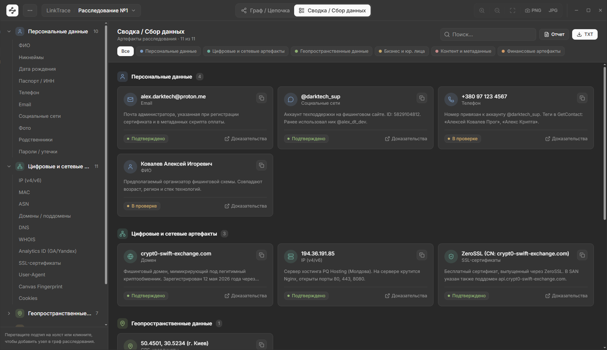
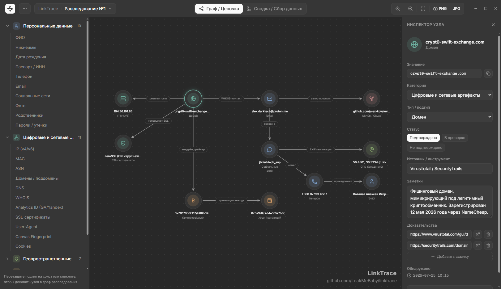

# LinkTrace — OSINT & Link Analysis Platform

<table>
  <tr>
    <td width="130" align="center">
      
    </td>
    <td>
      <h1>LinkTrace</h1>
      
Платформа для проведения OSINT-расследований, графового анализа цифровых следов и визуализации взаимосвязей между сущностями. Инструмент спроектирован для аналитиков киберразведки, форензик-специалистов, расследователей и служб безопасности.

      

        
        
        
      

    </td>
  </tr>
</table>

---

## 📸 Скриншоты интерфейса

### 1. Интерактивный граф связей (`Граф / Цепочка`)
Визуализация топологии расследования с узлами, классифицированными по типу, и динамическими связями между ними.

### 2. Сводка и сбор данных (`Сводка / Сбор данных`)
Структурированный реестр всех собранных артефактов с фильтрацией по категориям, статусам валидации и доказательной базой (пруфами).

### 3. Инспектор узла и улики (`Node Inspector`)
Панель детальной информации о выбранном элементе: источники сбора (WHOIS, RiskIQ, CRT.sh, Telegram), статус подтверждения, заметки и direct-ссылки на доказательства.

---

## ✨ Основные возможности

- 🕸 **Визуализация интерактивного графа (Graph View):**
  - Поддержка кастомных иерархий, типов узлов и ребер.
  - Удобная масштабируемая холст-карта с подсветкой зависимостей.
  - Боковая панель с хронологией обнаружения находок (*Timeline*).

- 📋 **Сводка и фильтрация артефактов:**
  - Группировка по категориям:
    - 👤 **Персональные данные** (ФИО, Telegram ID, Email, Номера телефонов, Паспорта/ИНН).
    - 🌐 **Цифровые и сетевые артефакты** (IP v4/v6, Домены, Subdomains, SSL-сертификаты, Analytics ID, Cookies, User-Agent).
    - 📍 **Геопространственные данные** (Адреса, Геолокации).
    - 🏢 **Бизнес и юр. лица** (Названия компаний, ОГРН / ИНН / КПП, Должности).
    - 💬 **Контент и метаданные** (Записи, Файлы, Утечки).
    - 💳 **Финансовые артефакты** (BTC-кошельки, Номера банковских карт, API-ключи AWS/GitLab).

- 🔍 **Детальный инспектор сущностей (Node Inspector):**
  - Присвоение статусов валидности: `Подтверждено`, `В проверке`, `Не подтверждено`.
  - Указание источника/инструмента обнаружения (RiskIQ, WHOIS, CT Logs, Telegram, Leak databases).
  - Прикрепление доказательств (*Evidence links*) и заметок к объектам.

- 💾 **Управление проектом и экспортом:**
  - Быстрое добавление элементов через палитру категорий.
  - Полный импорт и экспорт проекта в формате JSON (`Сохранить JSON`).
  - Быстрый поиск по всем сущностям, типам и значениям.
